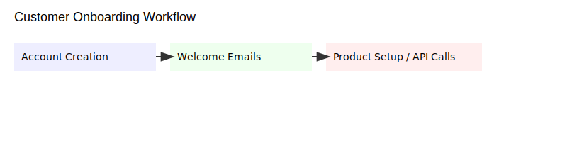
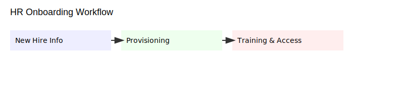

---
title: "Top 5 Business Automation Workflows"
subtitle: "Client-ready research brief (v2)"
author: "Kryon"
date: "2026-03-09"
lang: en-AU
...

# Top 5 Business Automation Workflows

## Client-ready research brief (v2)

**Prepared for:** Simon / Dynk  
**Prepared by:** Kryon  
**Date:** 9 March 2026

# Summary

This brief describes **five high-impact, sellable automation workflows** commonly delivered as packaged business outcomes:

1. Lead qualification
2. Customer onboarding
3. Invoice & payments automation
4. Support ticket triage & routing
5. Employee onboarding & HR automation

For each workflow, you’ll find:

- What it does (plain-English description)
- Typical pricing (market ranges)
- Estimated monthly run cost (API/LLM/ops)
- Recommended integrations
- A reference architecture diagram
- Setup time, ROI drivers, and target customers

# 1. Lead Qualification

## Description
Automate inbound lead capture, enrichment, scoring, and routing to the right sales rep—so **high-intent leads get a fast, relevant response**.

## Typical pricing
**$200–$1,500/month** per workflow (often tiered by volume and integration depth).

## Estimated cost to run
**$20–$200/month** (enrichment credits, email sending, light compute/automation platform fees).

## Integrations
CRM (HubSpot/Salesforce), web forms, enrichment (Clearbit/ZoomInfo), email, Zapier/Make, Slack.

## Architecture diagram
{.diagram}

## Setup time
**1–5 days** (template + field mapping + scoring logic + routing rules).

## ROI drivers
- Faster response time → higher conversion
- Better list hygiene and prioritisation
- Sales time focused on qualified leads

## Target customers
B2B services, SaaS, agencies, and any inbound-led growth motion.

## Example vendors / stacks
HubSpot workflows, Zapier/Make + enrichment + CRM automations, Outreach sequences.

# 2. Customer Onboarding

## Description
Automate account setup, welcome comms, tutorial flows, and initial configuration to improve **time-to-value** and reduce early churn.

## Typical pricing
**$300–$2,000/month** (or per-seat onboarding fee in some models).

## Estimated cost to run
**$30–$300/month** (email, automation, modest API usage).

## Integrations
Product API, CRM, email provider, docs (Notion/Google Docs), billing.

## Architecture diagram
{.diagram}

## Setup time
**3–14 days** (depends on product/API depth and onboarding complexity).

## ROI drivers
- Higher activation and retention
- Lower support burden during onboarding
- Consistent, repeatable customer experience

## Target customers
SaaS, membership products, B2B service providers with repeatable onboarding.

## Example vendors / stacks
Intercom onboarding flows, product-led onboarding orchestrations, CRM + lifecycle automation.

# 3. Invoice & Payments Automation

## Description
Generate invoices from orders, send reminders, reconcile payments, and create accounting entries—reducing manual finance ops and improving cashflow.

## Typical pricing
**$250–$1,200/month**.

## Estimated cost to run
**$10–$150/month** (varies with transaction volume and accounting API usage).

## Integrations
Stripe/PayPal, QuickBooks/Xero, invoice templates, email.

## Architecture diagram
{.diagram}

## Setup time
**2–7 days**.

## ROI drivers
- Lower days-sales-outstanding (DSO)
- Fewer missed invoices / follow-ups
- Cleaner reconciliation and reporting

## Target customers
Agencies, professional services, e-commerce, SMBs with recurring invoicing.

## Example vendors / stacks
Stripe + QuickBooks automations, Bill.com-style workflows, templated invoicing pipelines.

# 4. Support Ticket Triage & Routing

## Description
Auto-categorise, prioritise, and route support tickets; suggest knowledge-base articles; and trigger SLA timers—so teams resolve faster with less noise.

## Typical pricing
**$200–$1,000/month**.

## Estimated cost to run
**$20–$300/month** (LLM/NLP usage, semantic search, automation platform fees).

## Integrations
Zendesk/Freshdesk, Slack, email, knowledge base (Confluence/Notion), LLM APIs.

## Architecture diagram
{.diagram}

## Setup time
**2–10 days**.

## ROI drivers
- Faster first response and resolution
- Reduced ticket handling time
- More consistent routing and prioritisation

## Target customers
Any support team with volume: SaaS, marketplaces, IT support, B2B services.

## Example vendors / stacks
Zendesk automations, semantic search + routing layers, LLM-assisted triage.

# 5. Employee Onboarding & HR Automation

## Description
Automate new-hire paperwork, provisioning, training assignments, and access control—reducing admin load and improving compliance.

## Typical pricing
**$300–$2,500/month** (often per-hire or per-employee).

## Estimated cost to run
**$10–$200/month** (depends on hiring cadence and toolchain).

## Integrations
HRIS (BambooHR), Google Workspace / Microsoft 365, Slack, Okta, payroll systems.

## Architecture diagram
{.diagram}

## Setup time
**3–14 days**.

## ROI drivers
- Faster time-to-productivity
- Fewer provisioning errors
- Better auditability and compliance

## Target customers
SMBs scaling hiring, teams with repeatable role-based provisioning needs.

## Example vendors / stacks
BambooHR + Zapier/Make + Okta workflows, HRIS-driven provisioning.

# Notes on pricing and run costs

- Pricing varies by complexity, SLA, and number of integrations. A simple, sellable packaging is **tiered pricing**: Starter / Business / Enterprise.
- Run costs depend mostly on LLM/API usage, webhook volume, and storage. The easiest way to build trust is **transparent cost estimates** and clear margin targets.

# Next steps

- Produce client-ready collateral with consistent branding (this PDF)
- Package each workflow as a productised offer (scope, timeline, price, SLAs)
- Maintain a reusable integration library to reduce delivery time
